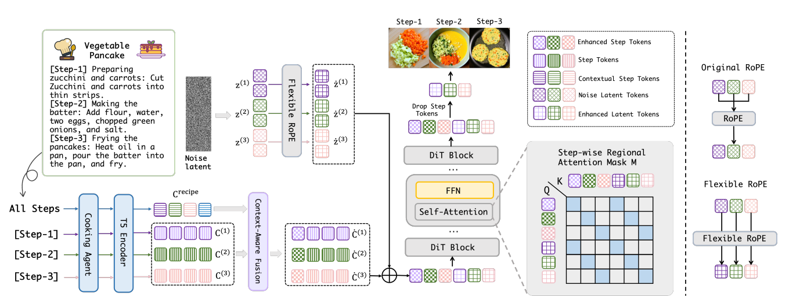

# CookAnything

**CookAnything: A Framework for Flexible and Consistent Multi-Step Recipe Image Generation** *Accepted at ACM Multimedia 2025 (MM'25)*

[**arXiv**](http://arxiv.org/abs/2512.03540) | [**Project Page**](https://zhangdaxia22.github.io/CookAnything/)



## Inference

Follow the steps below to set up the environment and run inference.

### 1. Prerequisites
First, you need to install the dependencies from the **Regional-Prompting-FLUX** repository. Please follow the installation instructions provided there:

* [https://github.com/instantX-research/Regional-Prompting-FLUX](https://github.com/instantX-research/Regional-Prompting-FLUX)

### 2. Implement Flexible RoPE
Modify the RoPE (Rotary Positional Embeddings) logic to support **Flexible RoPE**. 

Locate the latent generation section in your code and update it with the following logic:

```python
# Initialize latents with flexible dimensions
latents = randn_tensor(
    (1, num_channels_latents, int(height/width), width, width), 
    generator=generator, 
    device=device, 
    dtype=dtype
).repeat(batch_size, 1, 1, 1, 1).reshape((shape))

latents = self._pack_latents(latents, batch_size, num_channels_latents, height, width)

# Prepare latent image IDs
latent_image_ids = self._prepare_latent_image_ids(batch_size, width, width, device, dtype)
latent_image_ids = latent_image_ids.repeat(int(height/width), 1)
```
### 3. Run Inference
Ensure that pipeline_flux_region.py and infer.py are located in your working directory. You can then run the inference script using the following command:
```python
python infer.py
```
### 4. CookingAgent
We utilize GPT-4o as the **Cooking Agent**. The prompt is 
``` text
You are an expert in describing step-by-step food preparation for recipe images. I will provide a recipe, and your task isto describe what the food should look like in each step's corresponding image.
Follow these rules:
1. Tnclude all inaredients: fvery inaredient present in a step must be explicitly mentioned. Do not replace specificingredients with general dish names (e.g., instead of "kung Pao chicken," list individual ingredients such as "chickencubes, peanuts,dried chilies, scallions")
2. Describe shapes and cuts: Specify the form of each ingredient (e.g., sliced, diced, whole, chopped)
3. State the condition realistically: You may describe texture, color, and consistency, but avoid exaggerateddescriptions.
4. Exclude future ingredients: Do not mention ingredients or elements that only appear in later steps (e.g., if noodlesare added in the next step, do not say "ready to serve with noodles" in the current step).
5. Maintain descriptive consistency: Use consistent wording for each ingredient across steps. If an ingredient isdescribed as “thinly sliced cucumber” in Step 1, continue using the same shape and adjective (e.g., “thinly slicedcucumber") in later steps unless its form or condition has changed through cooking or preparation.
```
If you have any questions about CookAnything, please contact zhangrx22@mails.jlu.edu.cn.
